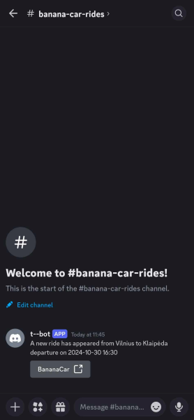

# Banana Car Notification Service

**Tired of frantically refreshing Banana Car to find that important ride later today? 😱**

Fear not! This application automatically scans for new rides and notifies about them in Discord:



## Discord commands

There are several commands available to manage ride subscriptions. Typing any of them in Discord will provide more
information:

* `/rides subscriptions list`
* `/rides subscriptions create`
* `/rides subscriptions delete`

## Set up

1. Make sure to set up `application-secrets.properties` with following secrets

```properties
discord.channelId=replace-secret
discord.token=replace-secret
```

2. Run `docker build -t bananacar-notification-svc -f Dockerfile .`
3. Start application `docker compose up -d`

## Schema changes

1. Add new database migration in `src/main/resources/db/changelog`
2. Start application
3. Run `./gradlew :generateJooq`

Database classes should now appear in `src/main/generated-db-entities`