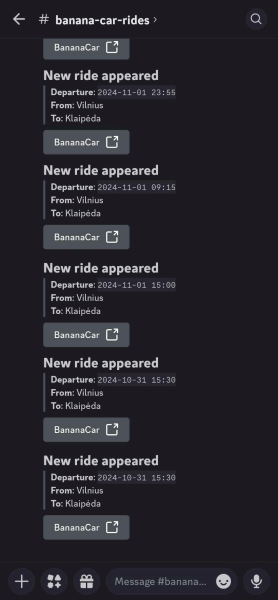

# Banana Car Notification Service

Tired of frantically refreshing Banana Car to find that ride tomorrow? Fear not! This service automatically scans for
rides and shares them in Discord:



## Set up

1. Make sure to set up properties

```properties
discord.channelId=replace-secret
discord.token=replace-secret
```

2. Start database `docker compose up -d`
3. Run the application

## Schema changes

1. Add new database migration in `src/main/resources/db/changelog`
2. Start application
3. Run `./gradlew :generateJooq`

Database classes should now appear in `src/main/generated-db-entities`